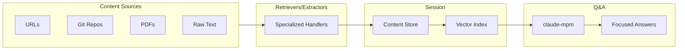

# Research-Mind

**Session-based content retrieval and orchestration for focused research**

> **New to the project?** See the [Getting Started Guide](docs/GETTING_STARTED.md) for complete installation instructions.

## Overview

Research-Mind provides a content retrieval and orchestration layer that allows users to create research sessions. Each session tracks user-added content sources (URLs, Git repos, PDFs, raw text) and enables question-answering based ONLY on that session's curated content.

The system uses specialized ingestion retrievers and data extractors for different content source types. This modular architecture provides flexibility for converting diverse source content into markdown that is easily digestible by indexing and LLM systems.

Research-Mind aims to transform how people gather and analyze information from multiple sources, reducing research time from hours to minutes while maintaining focus and accuracy.

## Problem Statement

1. **Content Fragmentation** - Information is scattered across websites, documents, repositories, and other sources. Existing tools do not make it easy to mix and match different content types in a session-based manner.

2. **Manual Collation Burden** - Even technically skilled users spend excessive time manually gathering, organizing, and cross-referencing information. This is tedious, error-prone, and does not scale.

Research-Mind solves this by providing an easy web interface to create sessions, add content sources of any type, and ask questions that draw answers only from the curated session content.

## Key Features

- **Session-Scoped Research** - Isolated research environments prevent context pollution between projects
- **Multi-Source Ingestion** - Support for URLs, Git repositories, PDFs, and raw text
- **Specialized Retrievers** - Each content type has dedicated ingestion and extraction logic
- **Semantic Indexing** - Automatic chunking and vector embedding via mcp-vector-search
- **Agentic Q&A** - claude-mpm powered question answering with iterative refinement
- **Extensible Architecture** - Add new source types by implementing retriever/extractor pairs

## Use Cases

### Company Product Research

A user needs to understand products listed across a company website. Information is scattered across web pages, PDF brochures, and blog posts.

**With Research-Mind:**

1. Create a new session
2. Add product page URLs and PDF brochures
3. Ask: "What are the key features of Product X?" or "Compare products A and B"
4. Receive focused answers from only the added sources

### Organizational Onboarding

A new team member needs to quickly understand what a product team does. Information is spread across wikis, Git repos, and meeting notes.

**With Research-Mind:**

1. Create a session for the team
2. Add wiki URLs, repo documentation, and call transcripts
3. Ask: "What products does this team own?" or "What are current priorities?"
4. Get up to speed in hours instead of weeks

## Architecture



**Flow:**

1. User creates a session and adds content sources
2. Specialized retrievers fetch and normalize content to markdown
3. Content is stored and indexed via mcp-vector-search
4. User asks questions through the chat interface
5. claude-mpm agent retrieves relevant chunks and generates answers

## Tech Stack

| Component      | Technology              | Purpose                           |
| -------------- | ----------------------- | --------------------------------- |
| Backend        | FastAPI, Python 3.12    | API services and content pipeline |
| Frontend       | SvelteKit 5, TypeScript | User interface                    |
| Vector Search  | mcp-vector-search       | Content indexing and retrieval    |
| Agent Runtime  | claude-mpm              | Agentic question answering        |
| Metadata Store | PostgreSQL 18           | Sessions, sources, audit logs     |

## Quick Start

```bash
# Install dependencies for both backend and frontend
make install

# Start development servers
make dev
```

**URLs:**

- Service API: http://localhost:15010
- Web UI: http://localhost:15000

**Verify installation:**

```bash
./scripts/verify-install.sh
```

For detailed setup instructions, see the sub-project documentation.

## Project Structure

```
research-mind/
├── research-mind-service/   # Python FastAPI backend
│   ├── app/                 # Application code
│   ├── docs/                # API contract and specs
│   └── CLAUDE.md            # Backend development guide
├── research-mind-ui/        # SvelteKit TypeScript frontend
│   ├── src/                 # Application code
│   ├── docs/                # Frontend documentation
│   └── CLAUDE.md            # Frontend development guide
├── docs/                    # Shared documentation
│   ├── summary/             # Executive summaries
│   └── plans/               # Implementation plans
├── CLAUDE.md                # Monorepo development guide
└── Makefile                 # Common development commands
```

## Documentation

- **Monorepo Guide**: [CLAUDE.md](./CLAUDE.md)
- **Backend Development**: [research-mind-service/CLAUDE.md](./research-mind-service/CLAUDE.md)
- **Frontend Development**: [research-mind-ui/CLAUDE.md](./research-mind-ui/CLAUDE.md)
- **API Contract**: [research-mind-service/docs/api-contract.md](./research-mind-service/docs/api-contract.md)
- **Executive Summary**: [docs/summary/executive-summary.md](./docs/summary/executive-summary.md)

## Status

**Current Phase:** MVP Development (Phase 1 Complete)

**Completed:**

- Core session management
- URL content retrieval
- Vector indexing pipeline
- Question-answering interface

**In Progress:**

- Git repository retriever
- PDF content extractor
- Enhanced agent capabilities
- UI refinements

## License

[License information pending]
