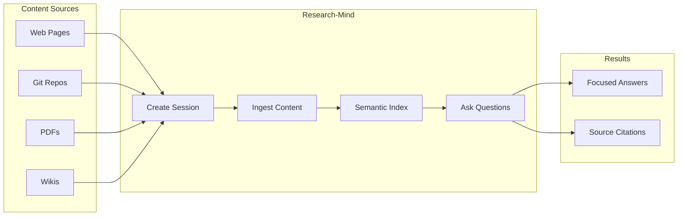
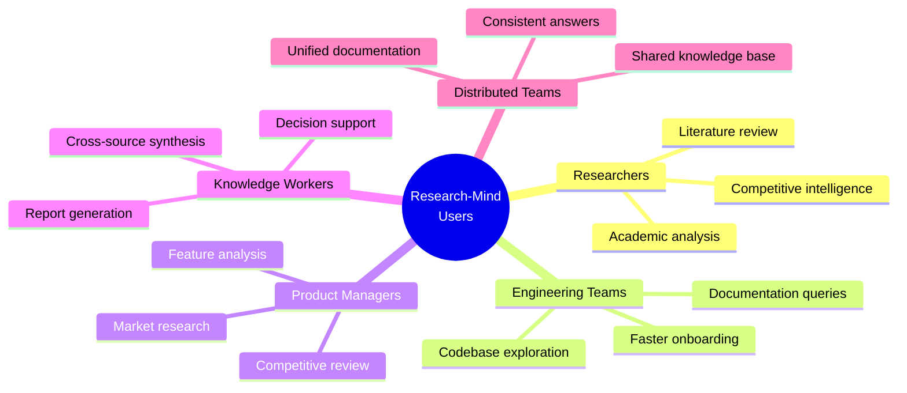
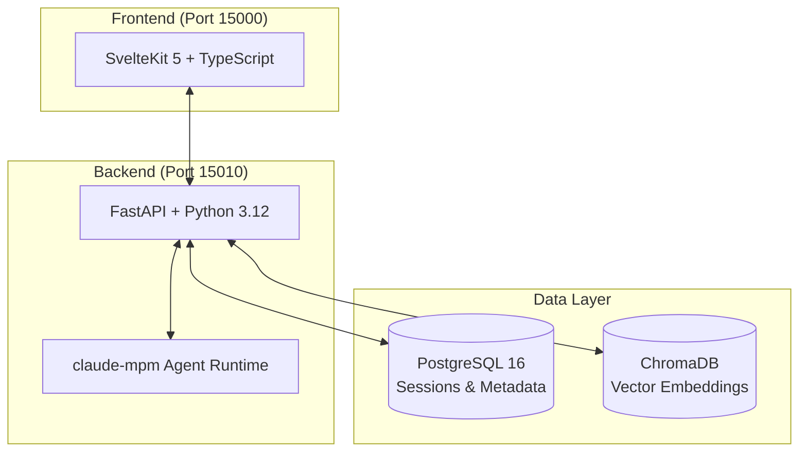

# Research-Mind: Executive Summary

## Executive Highlights

| Metric                 | Value                                                         |
| ---------------------- | ------------------------------------------------------------- |
| **Project Status**     | MVP Development (Phase 1 Complete)                            |
| **Time to MVP**        | 3-4 weeks remaining                                           |
| **Team Size**          | 2 FTE Engineers                                               |
| **Primary Value**      | Reduce research time from hours to minutes                    |
| **Key Differentiator** | Session-scoped research sandboxes eliminate context pollution |

---

## The Problem We Solve

Traditional search and retrieval systems index everything, leading to **semantic drift** where irrelevant content dilutes answer quality. When researchers ask complex questions across multiple sources, they receive generic responses contaminated by unrelated information.

**Research-Mind solves this** by allowing users to create focused research sessions with curated content sources. Context quality determines answer accuracy.

---

## What Research-Mind Does

Research-Mind is a **session-based research analysis system** that enables users to ask informed questions about specific topics by creating isolated "research sandboxes" containing curated content.

### Core Capabilities

| Capability                   | Description                                                                 |
| ---------------------------- | --------------------------------------------------------------------------- |
| **Session-Scoped Sandboxes** | Isolated research environments with no token contamination between sessions |
| **Multi-Source Ingestion**   | Web pages, Git repositories, PDFs, wikis, and documentation                 |
| **Semantic Indexing**        | Automatic chunking and embedding for 8+ programming languages               |
| **Agentic Q&A**              | Claude-powered question answering with iterative refinement                 |
| **Progress Tracking**        | Async indexing with real-time progress updates                              |
| **Security-First Design**    | Infrastructure-level sandboxing for content isolation                       |

---

## How It Works

**User Workflow:**

1. **Create Session** - Define a research topic and scope
2. **Add Sources** - Import relevant content (URLs, repos, documents)
3. **System Indexes** - Automatic chunking, embedding, and storage
4. **Ask Questions** - Query across all session content
5. **Get Answers** - Receive focused responses with source citations

---

## Target Users

---

## Technical Architecture

| Component       | Technology              | Purpose                     |
| --------------- | ----------------------- | --------------------------- |
| Frontend        | SvelteKit 5, TypeScript | User interface              |
| Backend         | FastAPI, Python 3.12    | API services                |
| Vector Database | ChromaDB                | Session-scoped embeddings   |
| Metadata Store  | PostgreSQL 16           | Sessions, users, audit logs |
| Agent Runtime   | claude-mpm              | AI orchestration            |

---

## Strategic Value Proposition

### Quantifiable Benefits

| Benefit                     | Impact                                    |
| --------------------------- | ----------------------------------------- |
| **Research Time Reduction** | Hours to minutes per research task        |
| **Answer Quality**          | Higher accuracy from focused context      |
| **Knowledge Preservation**  | Reusable research sessions                |
| **Onboarding Acceleration** | New team members productive faster        |
| **Cost Control**            | Token budgeting prevents runaway AI costs |

### Enterprise Considerations

- **Audit Logging** - Complete trail for compliance requirements
- **Session Isolation** - No cross-contamination between research projects
- **Security Architecture** - Infrastructure-level sandboxing
- **Type-Safe Development** - Reduced production errors

---

## Project Status

### Current State: MVP Development

**Phase 1 (Complete)**

- Core session management
- Basic content ingestion
- Vector indexing pipeline
- Question-answering interface

**Remaining Work (3-4 weeks)**

- Additional content retrievers (Git, PDF)
- Enhanced agent capabilities
- Production hardening
- User experience refinement

### Team

| Role                 | Allocation |
| -------------------- | ---------- |
| Full-Stack Engineers | 2 FTE      |

---

## Key Differentiators

| Traditional RAG Systems | Research-Mind               |
| ----------------------- | --------------------------- |
| Index everything        | Index only curated content  |
| Global search           | Session-scoped search       |
| Context pollution       | Clean context boundaries    |
| Generic answers         | Focused, relevant answers   |
| Single knowledge base   | Multiple isolated sandboxes |

---

## Next Steps

1. **Complete MVP** - Finalize remaining 3-4 weeks of development
2. **Pilot Program** - Internal testing with select teams
3. **Feedback Integration** - Iterate based on user experience
4. **Production Deployment** - Scale infrastructure for broader use

---

_Document generated: February 2026_
_For questions: Contact Engineering Leadership_
