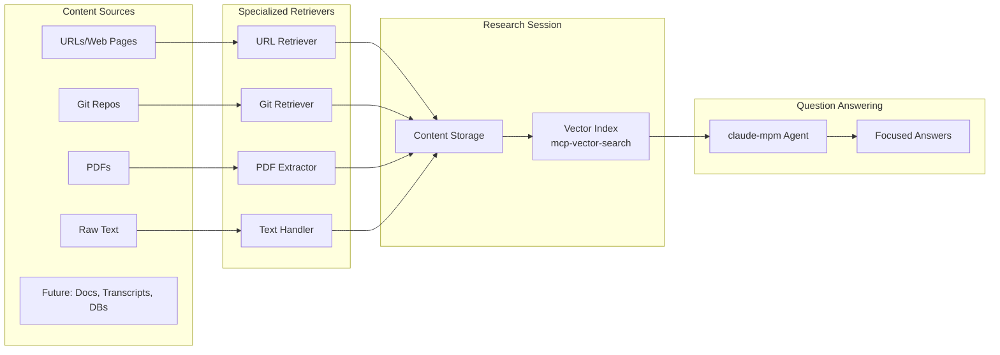
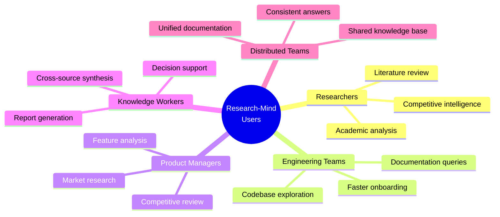
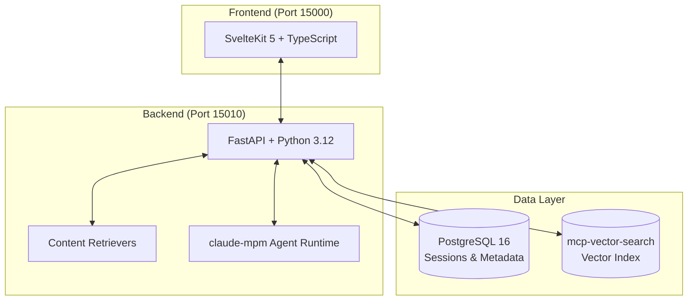

# Research-Mind: Executive Summary

## Executive Highlights

| Metric                 | Value                                                         |
| ---------------------- | ------------------------------------------------------------- |
| **Project Status**     | MVP Development (Phase 1 Complete)                            |
| **Time to MVP**        | 3-4 weeks remaining                                           |
| **Team Size**          | 2 FTE Engineers                                               |
| **Primary Value**      | Reduce research time from hours to minutes                    |
| **Key Differentiator** | Session-scoped research sandboxes eliminate context pollution |

---

## The Problem We Solve

Existing research tools make it difficult to mix and match different content sources in a session-based manner. When researching across websites, documents, code repositories, and other sources, users face two core challenges:

1. **Content Fragmentation** - Information is scattered across web pages, PDFs, Git repos, wikis, call transcripts, and databases. No single tool brings these together effectively.

2. **Manual Collation Burden** - Even technically skilled users spend excessive time manually gathering, organizing, and cross-referencing information sources. This is tedious, error-prone, and scales poorly.

**Research-Mind solves this** by providing a content retrieval and orchestration layer where users create research sessions, add diverse content sources, and ask questions based ONLY on that session's curated content.

---

## What Research-Mind Does

Research-Mind is a **session-based content orchestration system** that enables users to create focused research environments with curated content from multiple source types.

### Core Capabilities

| Capability                         | Description                                                                                                |
| ---------------------------------- | ---------------------------------------------------------------------------------------------------------- |
| **Session-Scoped Sandboxes**       | Isolated research environments with no content contamination between sessions                              |
| **Specialized Content Retrievers** | Different source types use dedicated ingestion retrievers and data extractors                              |
| **Multi-Source Ingestion**         | URLs, Git repositories, PDFs, raw text (future: Google Docs, call transcripts, databases, RSS, Confluence) |
| **Semantic Indexing**              | Automatic chunking and embedding via mcp-vector-search                                                     |
| **Agentic Q&A**                    | claude-mpm powered question answering with iterative refinement                                            |
| **Progress Tracking**              | Async indexing with real-time progress updates                                                             |

### Key Architecture Point

Different content source types use **specialized ingestion retrievers and data extractors**. This modular design provides flexibility for special handling to convert source content to raw markdown easily digestible by indexing and LLM systems. Adding new source types (e.g., Google Docs, Confluence) requires only implementing a new retriever/extractor pair.

---

## Use Cases

### Use Case 1: Company Product Research

**Scenario:** A user needs to understand products listed across a company website.

**Challenge:** Information is scattered across web pages, PDF brochures, and blog posts. Manual reading is time-consuming and may yield incomplete or inconsistent results.

**Research-Mind Solution:**

1. Create a new research session
2. Add relevant URLs (product pages, landing pages)
3. Add PDF brochures and documentation
4. Ask questions: "What are the key features of Product X?" or "How do products A and B compare?"
5. Receive focused answers drawn only from the curated sources

### Use Case 2: Organizational Onboarding

**Scenario:** A new team member needs to quickly understand what a product team does.

**Challenge:** Scope of responsibility is spread across internal wikis, Git repositories, design documents, and past meeting notes. Learning takes weeks of reading and asking colleagues.

**Research-Mind Solution:**

1. Create a new research session for the team
2. Add wiki URLs covering team processes
3. Add relevant Git repositories (READMEs, documentation)
4. Add call transcripts or meeting notes
5. Ask questions: "What products does this team own?" or "What are the team's current priorities?"
6. Get up to speed in hours instead of weeks

---

## How It Works

**User Workflow:**

1. **Create Session** - Define a research topic and scope
2. **Add Sources** - Import relevant content (URLs, repos, PDFs, text)
3. **System Processes** - Specialized retrievers extract and normalize content
4. **System Indexes** - Automatic chunking, embedding, and storage
5. **Ask Questions** - Query across all session content
6. **Get Answers** - Receive focused responses based only on session sources

---

## Target Users

---

## Technical Architecture

| Component          | Technology              | Purpose                       |
| ------------------ | ----------------------- | ----------------------------- |
| Frontend           | SvelteKit 5, TypeScript | User interface                |
| Backend            | FastAPI, Python 3.12    | API services                  |
| Content Retrievers | Python modules          | Source-specific ingestion     |
| Vector Index       | mcp-vector-search       | Session-scoped embeddings     |
| Metadata Store     | PostgreSQL 16           | Sessions, sources, audit logs |
| Agent Runtime      | claude-mpm              | Agentic question answering    |

---

## Strategic Value Proposition

### Quantifiable Benefits

| Benefit                     | Impact                               |
| --------------------------- | ------------------------------------ |
| **Research Time Reduction** | Hours to minutes per research task   |
| **Answer Quality**          | Higher accuracy from focused context |
| **Knowledge Preservation**  | Reusable research sessions           |
| **Onboarding Acceleration** | New team members productive faster   |
| **Source Flexibility**      | Mix any content types in one session |

### Enterprise Considerations

- **Audit Logging** - Complete trail for compliance requirements
- **Session Isolation** - No cross-contamination between research projects
- **Extensible Architecture** - Add new content source types without core changes
- **Type-Safe Development** - Reduced production errors

---

## Project Status

### Current State: MVP Development

**Phase 1 (Complete)**

- Core session management
- URL content retrieval
- Vector indexing pipeline
- Question-answering interface

**Remaining Work (3-4 weeks)**

- Additional content retrievers (Git, PDF)
- Enhanced agent capabilities
- Production hardening
- User experience refinement

### Team

| Role                 | Allocation |
| -------------------- | ---------- |
| Full-Stack Engineers | 2 FTE      |

---

## Key Differentiators

| Traditional RAG Systems | Research-Mind                     |
| ----------------------- | --------------------------------- |
| Index everything        | Index only curated content        |
| Global search           | Session-scoped search             |
| Context pollution       | Clean context boundaries          |
| Generic answers         | Focused, relevant answers         |
| Single knowledge base   | Multiple isolated sandboxes       |
| One-size-fits-all       | Specialized retrievers per source |

---

## Next Steps

1. **Complete MVP** - Finalize remaining 3-4 weeks of development
2. **Pilot Program** - Internal testing with select teams
3. **Feedback Integration** - Iterate based on user experience
4. **Production Deployment** - Scale infrastructure for broader use

---

_Document generated: February 2026_
_For questions: Contact Engineering Leadership_
